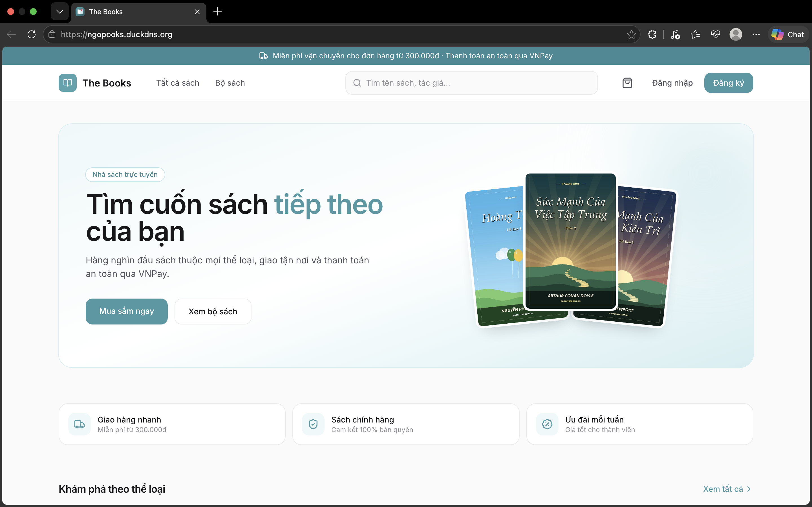
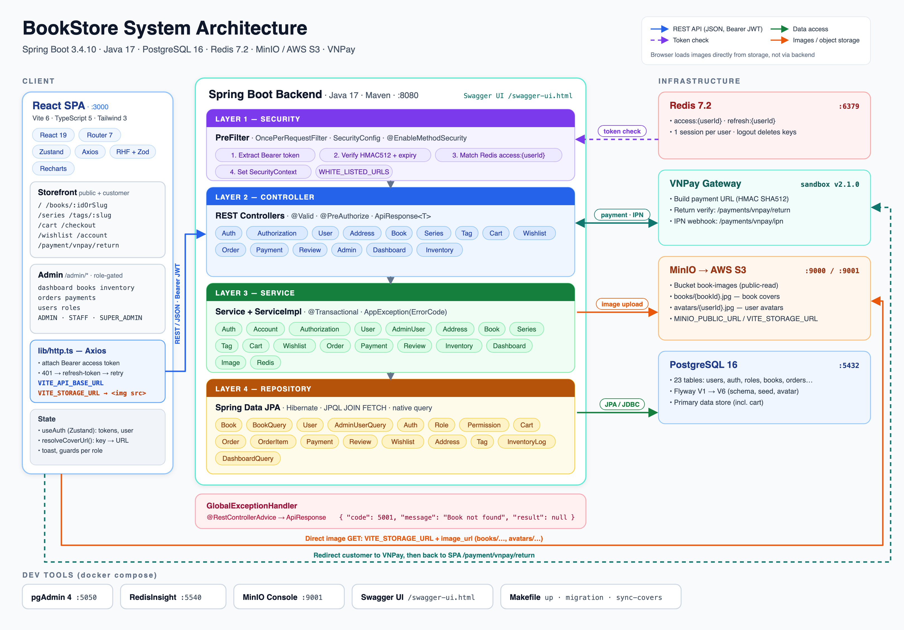

# Bookstore — Product Documentation

Product-level documentation for Bookstore: what the product does, who it serves, and how the system is put together. For implementation details, see the [Backend](../BE/README.md) and [Frontend](../FE/README.md) documentation.

**Live demo:** [https://ngopooks.duckdns.org/](https://ngopooks.duckdns.org/) — deployed on **AWS**.

---

## Contents

| Document | Description |
| :--- | :--- |
| [Product Overview](docs/01-product-overview.md) | Vision, target users, scope, and feature set |
| [User Roles](docs/02-user-roles.md) | Personas, responsibilities, and what each role can do |
| [System Architecture](docs/03-system-architecture.md) | Components, deployment view, and technology choices |
| [Key Flows](docs/04-key-flows.md) | Sign-in, shopping, checkout, payment, fulfilment, inventory |
| [Domain Model](docs/05-domain-model.md) | Core business concepts, lifecycles, and glossary |
| [Quality Attributes](docs/06-quality-attributes.md) | Security, consistency, performance, reliability, testability |

## Product Summary

| | |
| :--- | :--- |
| **Product** | Online bookstore with an integrated back office |
| **Users** | Guests, customers, and three internal roles (Staff, Admin, Super Admin) |
| **Market** | Vietnam (VND currency, VNPay payments, Vietnamese address format) |
| **Platform** | Responsive web application |
| **Status** | Demo / portfolio project |
| **Live demo** | [ngopooks.duckdns.org](https://ngopooks.duckdns.org/) |
| **Hosting** | Deployed on AWS |

