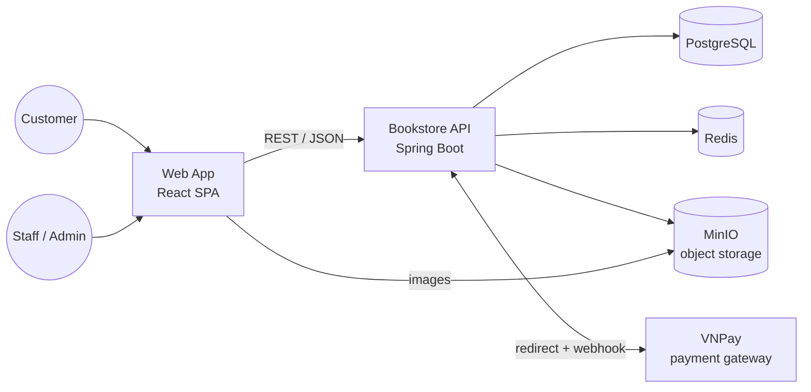
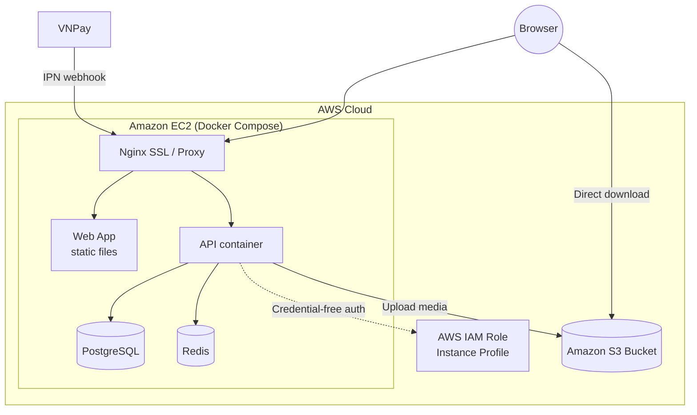

# 03 — System Architecture

## Context

## Components

| Component | Responsibility | Technology |
| :--- | :--- | :--- |
| **Web App** | Storefront and back-office UI in one single-page app with role-based navigation | React 19, TypeScript, Vite, Tailwind CSS |
| **Bookstore API** | Business logic, security, data access, integrations | Java 17, Spring Boot 3.4, Spring Security, JPA |
| **Database** | System of record: users, catalog, orders, payments, inventory, reviews | PostgreSQL 16, Flyway migrations |
| **Cache / session store** | Active sessions and lightweight counters | Redis 7 |
| **Object storage** | Book covers and avatars, served directly to browsers | MinIO (local) / Amazon S3 (AWS production) |
| **Payment gateway** | Online card and bank payments | VNPay |
| **Cloud Infrastructure** | Cloud hosting, identity, and object storage | AWS (EC2, S3, IAM) |

## Architectural Style

- **Modular monolith.** One deployable API, organised by business domain (catalog, orders, payments, …), with a strict layered structure inside each domain. This keeps operations simple while keeping the code ready to be split later.
- **Stateless API.** Requests are authenticated by token, so API instances can be scaled horizontally. Session revocation is centralised in Redis.
- **Single source of truth.** Business state lives in PostgreSQL. Redis holds only data that can be rebuilt.
- **API-first.** The web app relies only on the documented REST contract (OpenAPI).

## Deployment View

- Every service runs in containers, orchestrated with Docker Compose on an **Amazon EC2** virtual host.
- The API image is a multi-stage build that runs as a non-root user.
- In production, **Amazon S3** provides highly available media storage; **MinIO** is used for local offline development.
- **AWS IAM** instance profiles eliminate the need for hardcoded AWS secret keys on the server.
- Persistent data sits in named volumes backed by EBS.
- The database schema is versioned and applied automatically on startup.
- See [07 — AWS Deployment](07-aws-deployment.md) for full deployment architecture, IAM policies, and setup steps.

## Technology Choices

| Decision | Rationale |
| :--- | :--- |
| PostgreSQL | Strong constraints, transactions, JSONB snapshots, trigram search, all in one engine |
| Redis for sessions | Instant logout and account locking on top of stateless tokens |
| Object storage for images | Keeps binaries out of the database; browsers load images directly from S3 / MinIO |
| Amazon EC2 | Flexible, cost-efficient virtual compute hosting containerised services |
| AWS IAM Instance Profile | Keyless, rotated credential access from EC2 to S3 following the principle of least privilege |
| VNPay | Widely used payment gateway in Vietnam with a sandbox for development |
| One SPA for both interfaces | Shared components and types; role-based routing separates the audiences |
