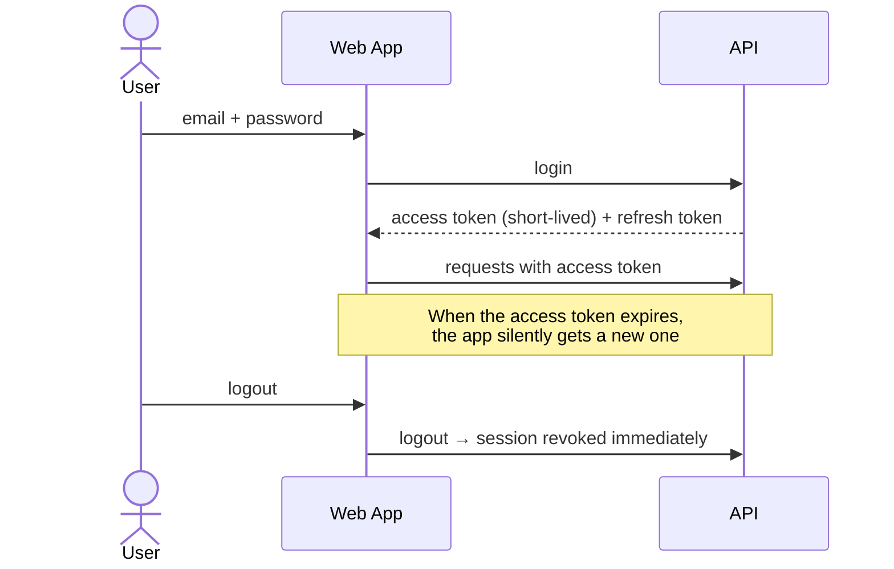
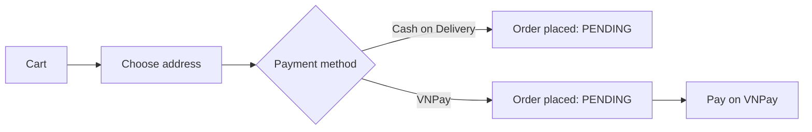
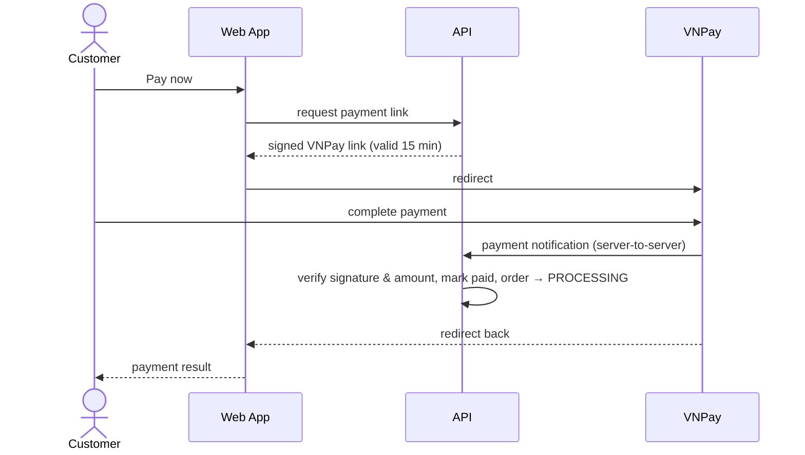
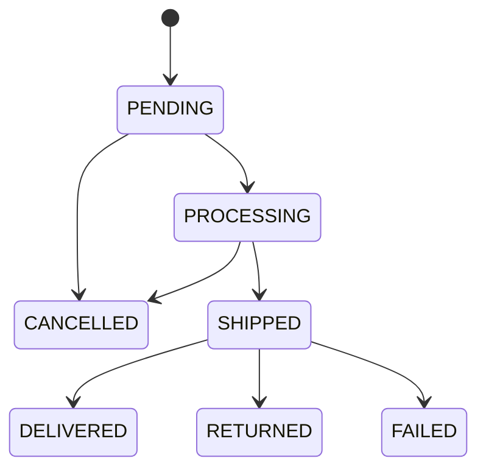

# 04 — Key Flows

## 1. Sign-in & Session

- Sessions are short-lived and renewed automatically, so users stay signed in without re-entering credentials.
- Logout, password change, and account locking end the session **immediately** on the server.

## 2. Shopping

1. The customer finds a book through search, tags, series, or the home page.
2. They add it to the **cart** or **wishlist**.
3. The cart always shows current prices and warns when a book became unavailable or has less stock than requested.

## 3. Checkout

When the order is placed, the system **in one step**:
- reserves the stock,
- records the order with a snapshot of prices and the shipping address,
- logs the stock movement,
- removes the purchased items from the cart.

If another customer bought the last copy a moment earlier, nothing is saved and the customer is told the stock is insufficient. Submitting twice (a double click or a network retry) never creates two orders.

## 4. Online Payment (VNPay)

- The **server-to-server notification** is what confirms a payment. The browser redirect is only used for display, so a closed tab or a tampered URL cannot fake a payment.
- Every notification is signature-checked and amount-checked, and repeated notifications are harmless.
- If a payment fails, the order stays open and the customer can pay again.

## 5. Order Fulfilment

- Staff move orders forward. Only valid transitions are accepted.
- Customers can cancel their own order until it ships (`PENDING` or `PROCESSING`).
- Cancelling returns the items to stock and voids any open payment attempt automatically.

## 6. Inventory

- Staff record **stock imports** with the supplier, invoice number, and unit cost.
- Every change (import, sale, return, adjustment, damage) is written to an **append-only history** with the quantity before and after.
- Books that fall below their threshold appear in a **low-stock** list and on the dashboard.

## 7. Account Administration

- Super Admin creates staff and admin accounts.
- Admin locks or unlocks customer accounts. Super Admin does the same for internal accounts.
- A locked user is signed out everywhere at once.
- A customer can deactivate their own account and reactivate it later. Banned accounts cannot be reactivated.
