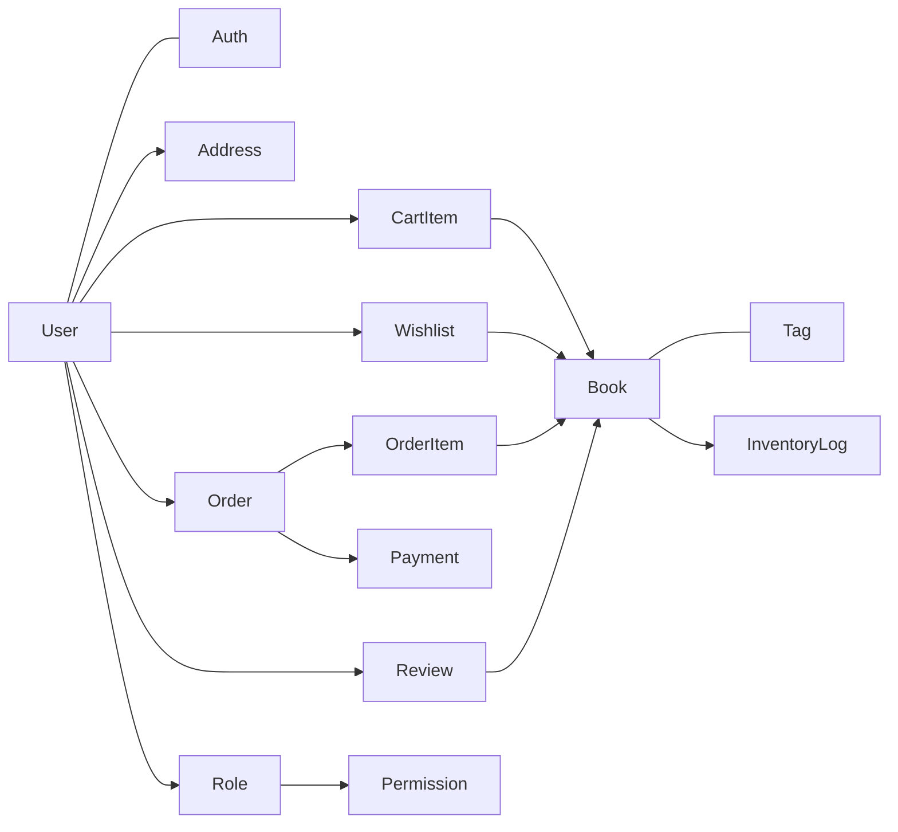

# 05 — Domain Model

## Core Concepts

## Lifecycles

| Entity | States |
| :--- | :--- |
| **Account** | `ACTIVE` ⇄ `INACTIVE` (self-deactivated) · `BANNED` (locked by an administrator) |
| **Book** | `ACTIVE` (visible) ⇄ `INACTIVE` (hidden) · soft-deleted (history kept) |
| **Order** | `PENDING → PROCESSING → SHIPPED → DELIVERED`, with `CANCELLED`, `RETURNED`, `FAILED` |
| **Payment** | `PENDING → PAID` or `FAILED` / `CANCELLED`; `REFUNDED` / `PARTIAL_REFUND` reserved |
| **Review** | `ACTIVE`, `PENDING` (awaiting moderation), `HIDDEN` |

## Business Rules

- An order keeps a **snapshot** of book titles, prices, and the shipping address, so later catalog changes never alter past orders.
- Stock can never go below zero.
- An order can be paid successfully **at most once**.
- Each customer has at most **one default address** and at most **one review per book**.
- A series is an ordered set of volumes of the same title, derived from the books themselves.

## Glossary

| Term | Definition |
| :--- | :--- |
| **Auth** | Login credentials, stored separately from the profile |
| **User** | Personal profile: name, phone, avatar, status |
| **Role** | A named set of permissions (Customer, Staff, Admin, Super Admin) |
| **Permission** | A single allowed action, written `RESOURCE:ACTION` |
| **Book** | A sellable title with price, cost price, stock, and metadata |
| **Category** | The fixed main genre of a book (Fiction, Science, Business, …) |
| **Tag** | A flexible label that groups books by theme |
| **Series** | An ordered collection of volumes |
| **Featured book** | A book pinned by an admin to the home page |
| **Cart item** | A book and quantity the customer intends to buy |
| **Wishlist** | Books saved for later |
| **Order** | A confirmed purchase request with a delivery address |
| **Order item** | One line of an order, with the price at purchase time |
| **Order code** | Human-readable order reference shown to customers |
| **Payment** | One attempt to pay an order online |
| **COD** | Cash on Delivery |
| **IPN** | Instant Payment Notification: VNPay's server-to-server confirmation |
| **Inventory log** | One recorded stock movement |
| **Stock import** | Goods received from a supplier |
| **Low-stock threshold** | The per-book quantity below which an alert is raised |
| **Verified purchase** | A review written by a customer who bought the book |
| **Helpful vote** | A customer marking a review as useful |
