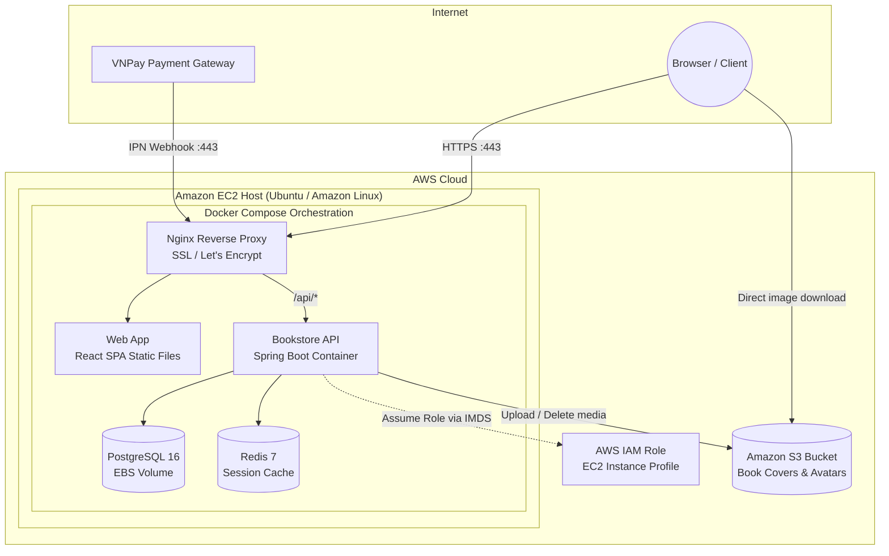

# 07 — AWS Deployment

This document describes how the Bookstore platform is deployed on **Amazon Web Services (AWS)** using **Amazon EC2**, **Amazon S3**, and **AWS IAM** to run a secure, cost-effective, and production-ready environment.

---

## Architecture Overview



---

## 1. Amazon EC2 (Compute & Container Host)

Amazon Elastic Compute Cloud (EC2) serves as the primary virtual host running all containerised application components under Docker Compose.

### Instance Specifications
- **Instance Type:** `t3.small` / `t3.medium` (2 vCPU, 2–4 GiB RAM), providing a balanced and cost-efficient tier with burstable CPU performance suitable for demo and small-to-medium workloads.
- **Operating System:** Ubuntu 22.04 LTS or Amazon Linux 2023.
- **Storage:** Amazon EBS gp3 volume (30+ GB) for OS root and Docker volumes (PostgreSQL data and Redis persistence).

### Service Orchestration
The EC2 host runs Docker and Docker Compose:
- **Nginx Reverse Proxy:** Terminates TLS/SSL certificates (automated via Let's Encrypt / Certbot), enforces HTTPS redirection, applies Gzip/Brotli compression, and routes `/api` traffic to the backend while serving frontend static files.
- **Backend API:** Multi-stage built container running the Spring Boot 3.4 application under a non-root user.
- **PostgreSQL 16:** Database container with named Docker volumes mapped to persistent EBS storage.
- **Redis 7:** In-memory store for active session registries, token revocation, and rate limiting.

### Security Group (Firewall) Configuration
Network access to the EC2 instance is restricted by an AWS Security Group:

| Type | Port / Protocol | Source | Purpose |
| :--- | :--- | :--- | :--- |
| **Inbound** | `80 / TCP` | `0.0.0.0/0` | HTTP traffic (redirected to HTTPS) |
| **Inbound** | `443 / TCP` | `0.0.0.0/0` | Secure HTTPS traffic and VNPay IPN webhooks |
| **Inbound** | `22 / TCP` | Admin IP / Bastion | Secure SSH remote administration |
| **Outbound** | All traffic | `0.0.0.0/0` | Package updates, Docker pulls, outbound S3 API calls, VNPay redirects |

---

## 2. Amazon S3 (Media & Object Storage)

Amazon Simple Storage Service (S3) provides cloud object storage for binary assets such as book covers, author images, and user avatars.

### Development vs Production Parity
- **Local Development:** The system runs an S3-compatible **MinIO** container locally to avoid cloud dependencies and bandwidth usage during local testing.
- **AWS Production:** The Spring Boot backend connects natively to an **Amazon S3** bucket. Both use identical S3 API clients and bucket structures, requiring zero code changes between environments.

### Bucket Architecture & Policies
- **Bucket Layout:**
  - `covers/`: High-resolution and thumbnail book cover images.
  - `avatars/`: Customer and staff profile pictures.
- **Direct Browser Serving:** To minimise backend overhead and bandwidth consumption on EC2, image files are served directly from S3 to user browsers via public HTTPS URLs or CloudFront CDN.
- **CORS Configuration:** Configured to allow `GET` requests originating from the web application domain (`ngopooks.duckdns.org`).
- **Access Control:** The bucket uses granular object permissions allowing public read access exclusively to the media prefixes (`covers/*`, `avatars/*`), while write and delete operations require authorized IAM credentials.

---

## 3. AWS IAM (Identity & Access Management)

AWS IAM manages authentication and authorisation between the EC2 host and AWS cloud services following the **principle of least privilege**.

### Eliminating Long-Lived Credentials
- **No hardcoded API keys:** No `AWS_ACCESS_KEY_ID` or `AWS_SECRET_ACCESS_KEY` pairs are committed to source code or stored in `.env` files.
- **EC2 Instance Profile:** An IAM Role is attached directly to the EC2 instance metadata.
- **Automatic Credential Rotation:** When the Spring Boot application interacts with Amazon S3 using the AWS SDK, the SDK automatically queries the EC2 Instance Metadata Service (IMDSv2) to fetch short-lived, rotated credentials.

### IAM Policy Definition
The attached IAM policy strictly limits access to the dedicated application bucket:

```json
{
  "Version": "2012-10-17",
  "Statement": [
    {
      "Sid": "BookstoreS3MediaAccess",
      "Effect": "Allow",
      "Action": [
        "s3:PutObject",
        "s3:GetObject",
        "s3:DeleteObject"
      ],
      "Resource": "arn:aws:s3:::bookstore-media-production/*"
    },
    {
      "Sid": "BookstoreS3BucketListing",
      "Effect": "Allow",
      "Action": [
        "s3:ListBucket"
      ],
      "Resource": "arn:aws:s3:::bookstore-media-production"
    }
  ]
}
```

---

## 4. Provisioning & Deployment Workflow

### Step 1: AWS Infrastructure Setup
1. Create the S3 bucket (e.g. `bookstore-media-production`) with appropriate CORS rules.
2. Create an IAM Role for EC2 with the least-privilege S3 policy attached, then assign it as the EC2 Instance Profile.
3. Launch an EC2 instance with the configured Security Group and attach the IAM Role.

### Step 2: Server Initialization
1. Install Docker, Docker Compose, and Git on the EC2 instance.
2. Clone the repository and configure dynamic DNS / domain mapping (e.g., DuckDNS pointing to the public Elastic IP).

### Step 3: Environment Configuration
Supply production environment variables securely via an environment file (`.env`):
- `SPRING_PROFILES_ACTIVE=prod`
- `AWS_REGION=ap-southeast-1`
- `AWS_S3_BUCKET=bookstore-media-production`
- Database credentials, Redis connection strings, and VNPay merchant configuration.

### Step 4: Launch & TLS Setup
1. Launch services with Docker Compose:
   ```bash
   docker compose -f docker-compose.prod.yml up -d --build
   ```
2. Run Certbot to acquire a Let's Encrypt SSL/TLS certificate for the domain.
3. Automatic renewal is configured via a systemd timer or cron job.

---

## 5. Security & Maintenance Practices

- **IMDSv2 Enforcement:** Token-based instance metadata requests are required to defend against SSRF vulnerabilities.
- **Isolated Containers:** Database and cache containers are not exposed to the public internet; they communicate via an internal Docker bridge network.
- **Database Backups:** Automated daily snapshots using EBS Snapshots and scheduled database dumps stored in an encrypted private S3 backup bucket.
- **Monitoring & Health Checks:** The Spring Boot `/actuator/health` endpoint actively monitors connectivity to PostgreSQL, Redis, and S3.
